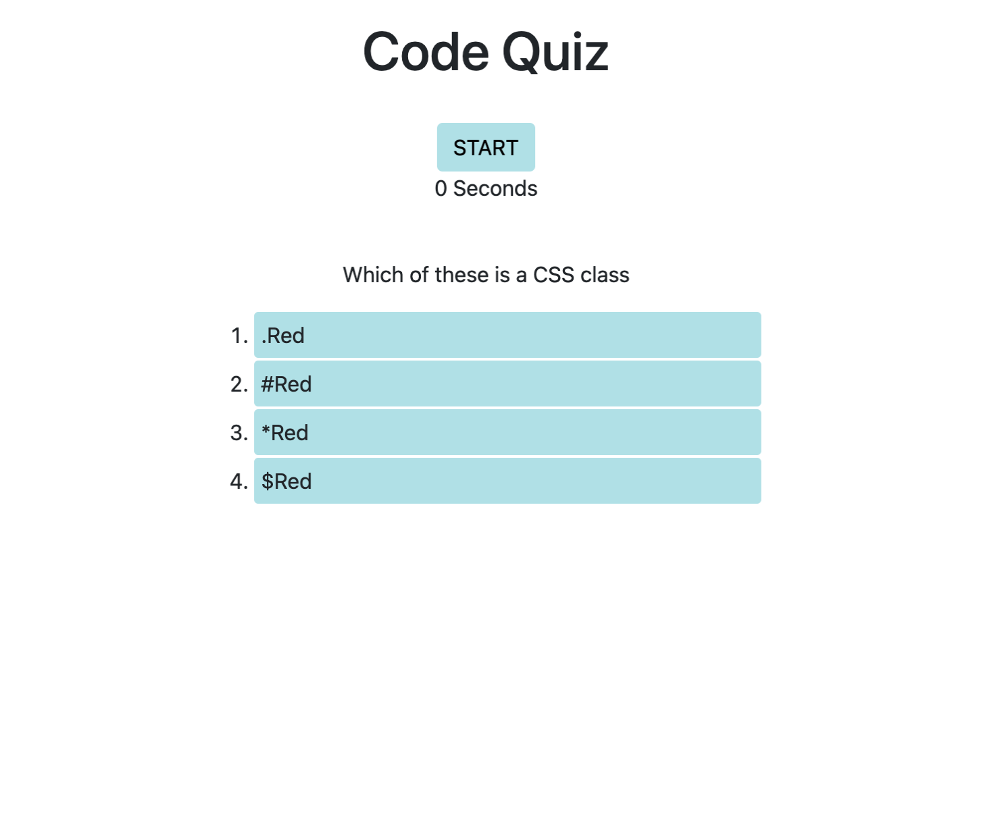

# Code Quiz
This is a 10 question code quiz. The application gives the user 180 seconds to complete the ten questions. After the 10 questions are answered, the user is then taken to a page where they can enter their initials in order to retrieve their final results. Each question answered incorrectly takes away 20 seconds from the user. 

## Technology

The website was built using HTML, CSS and Javascript, Bootsrap and JQuery. 

## Pages

Single responsive page containing the quiz

## Pages
Refactor CSS and JS documents

## Contributing

Pull requests are welcome, but should be limited to improving the layout and styles. No special software is required to clone and run the website other than a basic code editor and a browser of choice. 

## License

MIT